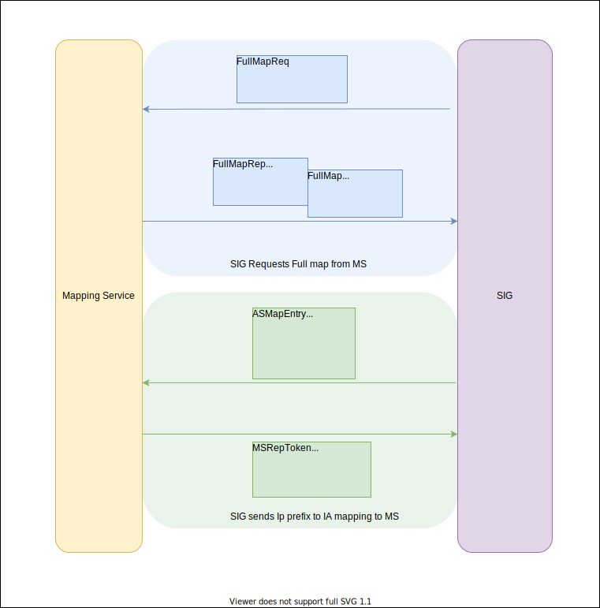

# Requests from SIG to MS

 The messages exchanged are shown in the diagram. Additionally, all messages exchanged are signed using SCION control plane PKI

## Handlers in MS
The handlers are contained in the folder [go/ms/sigcomm](../go/sig/sigcomm).
- FullMapReqHandler - Handles the message FullMapReq and returns FullMapRep to the requesting SIG. It performs the following actions:
    - Get full map from the database. For more on the MS database see [MS Database](MappingService.md#Database)
    - Form the ms_mgmt.FullMap payload 
    - use the messenger instance in msmsgr package to the requesting SIG by using the Peer and request ID from the incoming request

- ASActionHandler -  Handlers addition or revocation of mappings that can be submitted by SIGs to MS. It performs the following actions:
    - verify the signature on the full payload with the SCION cpki to validate source AS of the request using the [go/pkg/trust](../go/pkg/trust) package 
    - validate that the AS entry (ASMapEntry.Ia) is the same as the source IA
    - validate that the IP prefix to be added is owned by the IA requesting to add it. For this use an external RPKI validator by executing the script from the path in the MS configuration
    - Convert the full message recieved from the SIG, including the AS signature of the SIG, to bytes(packedMessage) and insert it as a new entry in the Database. For more on MS database see [MS Database](MappingService.md#Database)
    - Form the MSRepToken with the packedMessage and a timestamp that is max_ms_as_add_time (more on [max_ms_as_add_time](SigPrefixListProtocol.md#Global\ Configuration))  minutes from the current time as a guarantee that the MS will submit the new entry to the Publishing Infrastructure. 
    - Send MSRepToken to the requesting SIG using the messenger instance from msmsgr package.